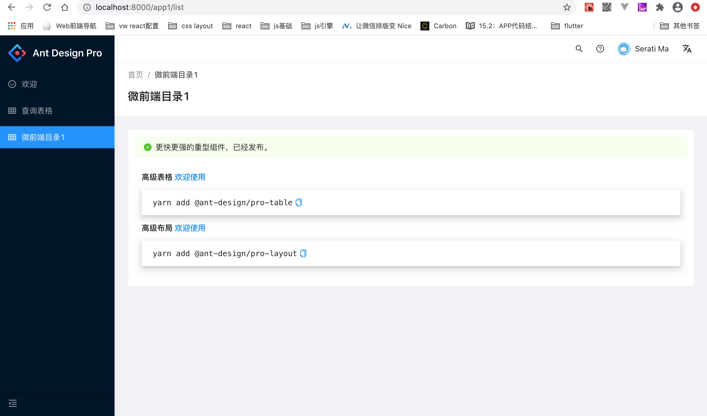

<!--
 * @Date: 2020-09-29 16:55:40
 * @LastEditors: hu.wenjun
 * @LastEditTime: 2020-10-23 09:11:23
-->
资料：

   
### @umijs/plugin-qiankun 实践

本文目的在于记录对plugin-qiankun的实践应用，其中需要完成的需求如下：

#### npm包版本如下： 
"umi": "^3.2.14"
"qiankun": "^2.1.1"
"@umijs/plugin-qiankun": "^2.16.0"

#### 基座建立

[Ant Design Pro](https://pro.ant.design/docs/getting-started-cn)
空白文件夹譬如micro-umi,运行如下命令：
```
yarn create umi
```
or
```
npm create umi
```
安装依赖
```
npm install
```
本地运行
```
npm start
```
在基座中加入qiankun以及适用于qiankun的umi的npm包
```
npm install --save-dev qiankun @umijs/plugin-qiankun
```
基座应用设置

```
//config/config.ts
qiankun: {
  master: {
    apps: [
        {
          name: 'app1', // 唯一 id
          entry: '//localhost:8001', // html entry
        }
    ],
    //   jsSandbox: true, // 是否启用 js 沙箱，默认为 false
    //   prefetch: true, // 是否启用 prefetch 特性，默认为 true
  },
}
```
此时基座设置完成

#### 子应用建立

和基座一样生成一个项目，同时安装@umijs/plugin-qiankun，谨记，@umijs/plugin-qiankun的版本要一致

开始配置子应用
设置
```
//config/config.ts
qiankun: {
    slave: {}
  },
```
然后设置
```
//src/app.ts
export const qiankun = {
  // 应用加载之前
  async bootstrap(props: any) {
    console.log('app1 bootstrap', props);
  },
  // 应用 render 之前触发
  async mount(props: any) {
    console.log('app1 mount', props);
  },
  // 应用卸载之后触发
  async unmount(props: any) {
    console.log('app1 unmount', props);
  },
}
```
此段代码对应的是子应用的生命周期

配置结束，运行，结果如下：


#### 主应用和子应用通信

需要配合useModel()使用，确保已安装了 @umijs/plugin-model 或 @umijs/preset-react

上面采用的是“路由绑定”形式装载子应用，所以使用的方式为
```
// src/app.ts
export function useQiankunStateForSlave() {
  const [masterState, setMasterState] = useState({});
 
  return {
    masterState,
    setMasterState,
  }
}
```
配置结束之后就可以在子应用中使用
具体使用如下：
```
//src/pages/Welcome.tsx
import { useModel } from 'umi';

const {masterState, setMasterState} = useModel('@@qiankunStateFromMaster');
  console.log(masterState, "=====masterPropsmasterPropsmasterPropsmasterProps===")
  useEffect(() => {
    setMasterState({
      name: '张三',
      age: 2
    })
    return () => {}
  }, [])
  //Objectage: 2name: "张三"__proto__: Object "=====masterPropsmasterPropsmasterPropsmasterProps==="
```
